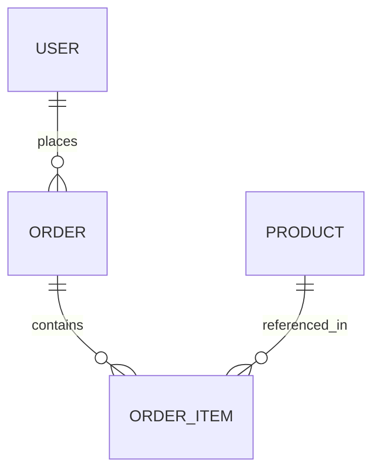
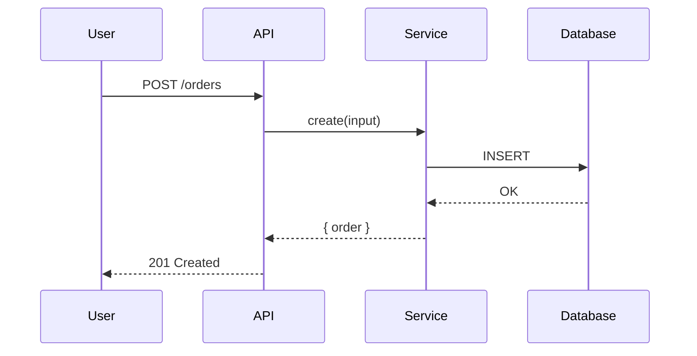
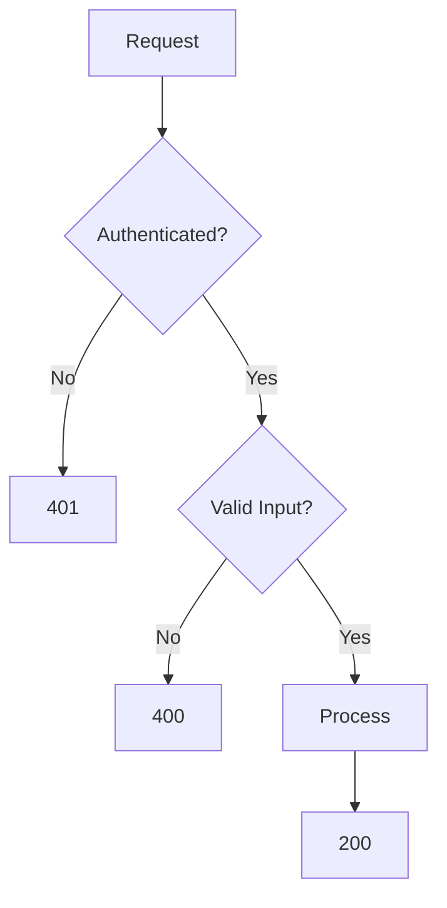

# Documentation Standards

This document defines the documentation standards for software projects. All exported code must be documented according to these rules.

---

## Table of Contents

1. [Documentation Philosophy](#documentation-philosophy)
2. [JSDoc Standards](#jsdoc-standards)
3. [API Documentation](#api-documentation)
4. [Architecture Decision Records](#architecture-decision-records)
5. [Changelog Format](#changelog-format)
6. [Code Comments](#code-comments)
7. [Diagrams](#diagrams)

---

## Documentation Philosophy

### Core Principles

**Code is Documentation:**

- Self-explanatory code is better than extensive comments
- Good naming is better than explaining what code does
- Tests document expected behavior

**Documentation is Code:**

- Keep docs close to code
- Update docs with code changes
- Review docs in code reviews

**Audience-First:**

- Write for future developers
- Write for your future self
- Be clear and concise

---

## JSDoc Standards

### Required for All Exports

**Every exported function, class, and type MUST have JSDoc.**

### Function Documentation

```typescript
/**
 * Creates a new user account with validation and authorization checks
 *
 * @param {Object} params - Input parameters
 * @param {CreateUserInput} params.input - User data to create
 * @param {string} params.input.name - User's full name (1-200 characters)
 * @param {string} params.input.email - User's email address (must be unique)
 * @param {User} params.currentUser - The authenticated user performing this action
 *
 * @returns {Promise<CreateUserOutput>} Object containing the created user
 *
 * @throws {ValidationError} When input validation fails
 * @throws {ConflictError} When email already exists
 * @throws {ForbiddenError} When current user lacks permissions
 *
 * @example
 * ```typescript
 * const result = await createUser({
 *   input: { name: 'John Doe', email: 'john@example.com' },
 *   currentUser: adminUser,
 * });
 * console.log(result.user.id);
 * ```
 *
 * @see {@link UserService} for related operations
 * @since 1.0.0
 */
export const createUser = async (params: CreateUserParams): Promise<CreateUserOutput> => {};
```

### Type Documentation

```typescript
/**
 * Represents a user account in the system
 *
 * @property {string} id - Unique identifier (UUID v4)
 * @property {string} name - User's full name
 * @property {string} email - User's email address (unique)
 * @property {UserRole} role - User's role in the system
 * @property {Date} createdAt - Account creation timestamp
 * @property {Date | null} deletedAt - Soft deletion timestamp (null if active)
 */
export type User = {
  id: string;
  name: string;
  email: string;
  role: UserRole;
  createdAt: Date;
  deletedAt: Date | null;
};
```

### Essential JSDoc Tags

**Required:**

- `@param` - Function parameters (with types)
- `@returns` - Return value (with type)
- `@throws` - Possible errors

**Highly Recommended:**

- `@example` - Working code examples (at least 1)
- `@see` - Related code/documentation

**Optional:**

- `@since` - Version introduced
- `@deprecated` - Deprecation info with migration path
- `@complexity` - Time/space complexity
- `@sideEffects` - Side effects (database, email, logs)

---

## API Documentation

### OpenAPI (Swagger)

**All API endpoints MUST have OpenAPI documentation.**

```typescript
/**
 * @openapi
 * /api/users:
 *   post:
 *     summary: Create a new user
 *     tags:
 *       - Users
 *     security:
 *       - bearerAuth: []
 *     requestBody:
 *       required: true
 *       content:
 *         application/json:
 *           schema:
 *             $ref: '#/components/schemas/CreateUserInput'
 *     responses:
 *       201:
 *         description: User created successfully
 *       400:
 *         description: Validation error
 *       401:
 *         description: Not authenticated
 *       409:
 *         description: Email already exists
 */
```

### API Endpoint Documentation

For complex APIs, create separate markdown files:

```markdown
# Users API

## Overview
Base URL: `/api/users`

## Endpoints

### List Users
`GET /api/users`

| Parameter | Type   | Required | Default | Description    |
|-----------|--------|----------|---------|----------------|
| q         | string | No       | -       | Search query   |
| page      | number | No       | 1       | Page number    |
| pageSize  | number | No       | 20      | Items per page |

### Create User
`POST /api/users`

**Authentication:** Required
**Request Body:** { name, email, role }
**Responses:** 201, 400, 401, 409
```

---

## Architecture Decision Records

### ADR Format

```markdown
# ADR-{NNN}: {Title}

## Status
Proposed | Accepted | Deprecated | Superseded

## Context
{What is the issue that motivates this decision?}

## Decision
{What is the change that we are proposing and/or doing?}

## Rationale
{Why this decision over alternatives?}

## Consequences

### Positive
- {Benefit 1}
- {Benefit 2}

### Negative
- {Tradeoff 1}
- {Tradeoff 2}

## Alternatives Considered
1. {Alternative 1} - Pros/Cons
2. {Alternative 2} - Pros/Cons

## Review
- Date: YYYY-MM-DD
- Reviewers: {Team}
- Next Review: YYYY-MM-DD
```

---

## Changelog Format

### Keep a CHANGELOG.md

Follow [Keep a Changelog](https://keepachangelog.com/en/1.0.0/) format:

```markdown
# Changelog

All notable changes to this project will be documented in this file.

The format is based on [Keep a Changelog](https://keepachangelog.com/en/1.0.0/),
and this project adheres to [Semantic Versioning](https://semver.org/).

## [Unreleased]

### Added
- Search functionality for products

### Changed
- Improved performance of listing queries

## [1.2.0] - YYYY-MM-DD

### Added
- Webhook support for notifications
- Rate limiting on API endpoints

### Changed
- Updated database driver to v5

### Fixed
- Fixed pagination bug in list view
- Fixed timezone handling

### Security
- Updated dependencies with security patches

## [1.1.0] - YYYY-MM-DD

### Added
- Payment processing integration
- Admin dashboard
```

### Changelog Categories

| Category | Description |
|----------|-------------|
| `Added` | New features |
| `Changed` | Changes to existing functionality |
| `Deprecated` | Soon-to-be removed features |
| `Removed` | Removed features |
| `Fixed` | Bug fixes |
| `Security` | Vulnerability fixes |

---

## Code Comments

### When to Comment

**DO comment:**

- WHY something is done a certain way
- Complex algorithms and their rationale
- Non-obvious business logic
- Temporary workarounds (with TODO)
- Performance optimizations and their reasoning

**DON'T comment:**

- What the code does (make the code self-explanatory)
- Obvious operations
- Redundant information that duplicates the code

### TODO Comments

```typescript
// TODO: Optimize this query with an index on (userId, createdAt)
// Current performance: ~500ms for 10k records
// Target performance: <50ms
const results = await db.query.find({ where: { userId } });
```

---

## Diagrams

### Use Mermaid for Inline Diagrams

**Entity Relationships:**



**Sequence Diagrams:**



**Flowcharts:**



---

## Summary Checklist

Before considering documentation complete:

- [ ] All exports have comprehensive JSDoc
- [ ] API endpoints have OpenAPI documentation
- [ ] Architecture decisions documented (ADRs)
- [ ] CHANGELOG updated for releases
- [ ] All examples work and are tested
- [ ] No broken links
- [ ] Diagrams for complex flows

---

**Documentation is not optional. Undocumented code will be rejected in code review.**
