# Mermaid Diagram Specialist

## Purpose

Create precise, well-structured Mermaid diagrams for software documentation. Covers flowcharts, sequence diagrams, ER diagrams, class diagrams, state diagrams, Gantt charts, and more. Provides syntax reference, best practices, and common patterns.

## Activation

Use this skill when the user asks to:
- Create or generate any kind of diagram
- Visualize architecture, flows, or relationships
- Document system interactions
- Create ER diagrams for database schemas
- Illustrate state machines or workflows

## Syntax Reference

### Flowchart

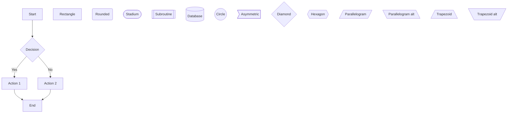

**Direction options:** `TD` (top-down), `LR` (left-right), `BT` (bottom-top), `RL` (right-left)

**Link styles:**
```
A --> B           %% Arrow
A --- B           %% Line
A -.-> B          %% Dotted arrow
A ==> B           %% Thick arrow
A -->|text| B     %% Arrow with text
A -- text --- B   %% Line with text
```

### Sequence Diagram

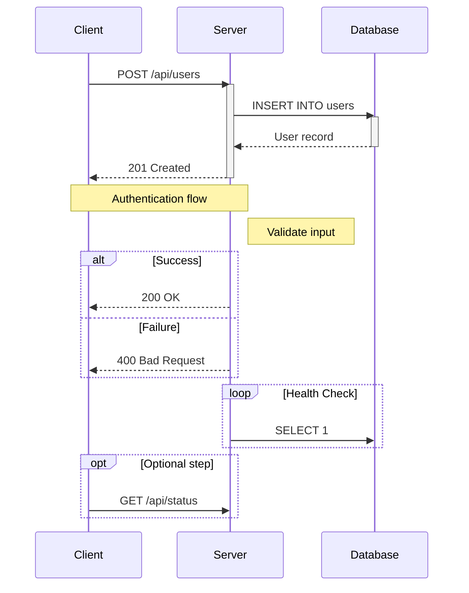

**Arrow types:**
```
->>    Solid arrow (synchronous)
-->>   Dashed arrow (asynchronous/response)
-x     Solid with X (lost message)
--x    Dashed with X
-)     Solid open arrow
--)    Dashed open arrow
```

### Entity Relationship Diagram

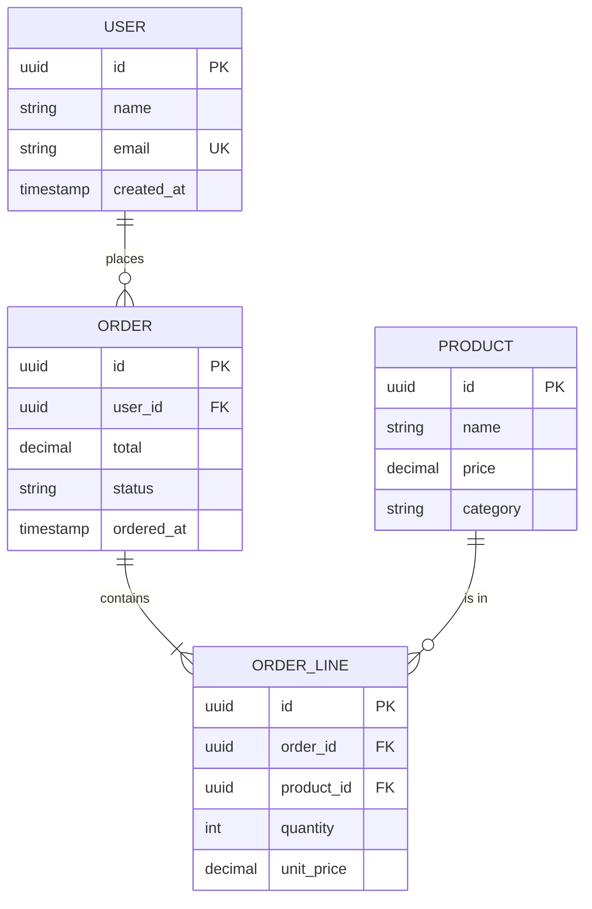

**Relationship types:**
```
||--||   One to one
||--o{   One to zero or more
||--|{   One to one or more
o{--o{   Zero or more to zero or more
```

### Class Diagram

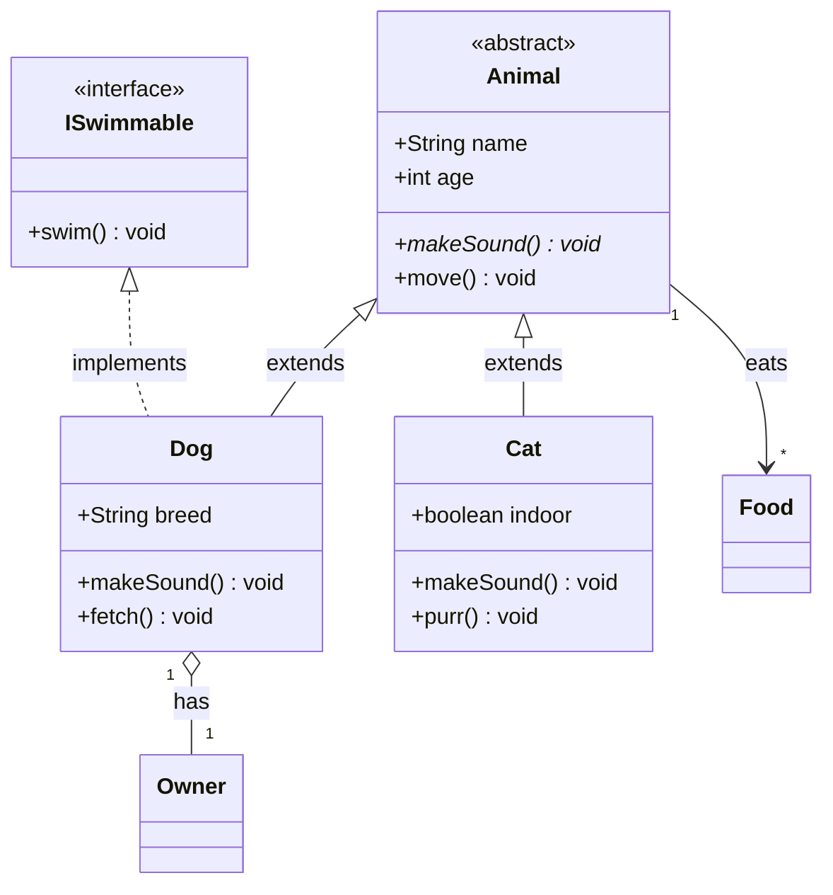

**Relationship types:**
```
<|--    Inheritance
*--     Composition
o--     Aggregation
-->     Association
--      Link (solid)
..>     Dependency
..|>    Realization
```

**Visibility:**
```
+   Public
-   Private
#   Protected
~   Package/Internal
```

### State Diagram

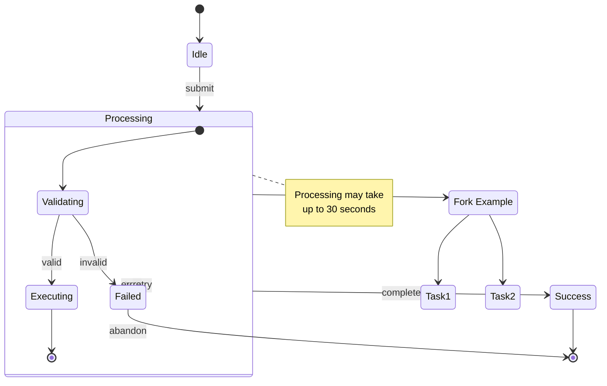

### Gantt Chart

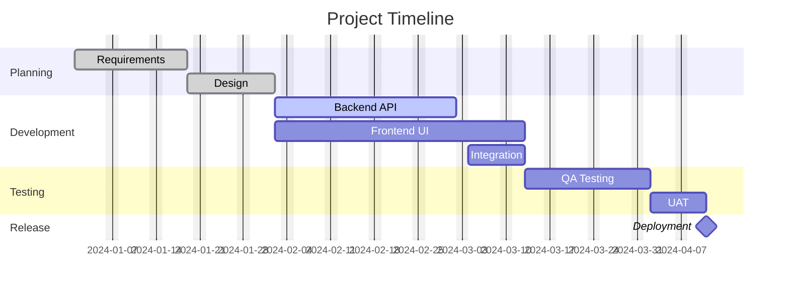

### Pie Chart

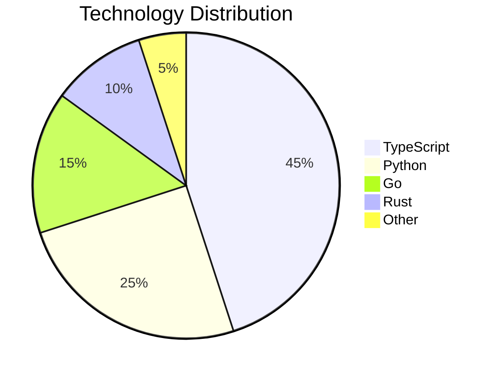

### Git Graph

```mermaid
gitgraph
    commit id: "Initial"
    branch develop
    checkout develop
    commit id: "Feature A"
    commit id: "Feature B"
    checkout main
    merge develop id: "Release 1.0"
    branch hotfix
    checkout hotfix
    commit id: "Fix bug"
    checkout main
    merge hotfix id: "Patch 1.0.1"
```

## Best Practices

### Layout and Readability

1. **Use top-down for hierarchies**, left-right for sequences/flows
2. **Keep diagrams focused** - one concept per diagram, max 15-20 nodes
3. **Use subgraphs** to group related nodes in flowcharts
4. **Label all edges** with meaningful descriptions
5. **Use consistent naming** - PascalCase for classes, camelCase for methods, UPPER_SNAKE for tables

### Subgraph Organization

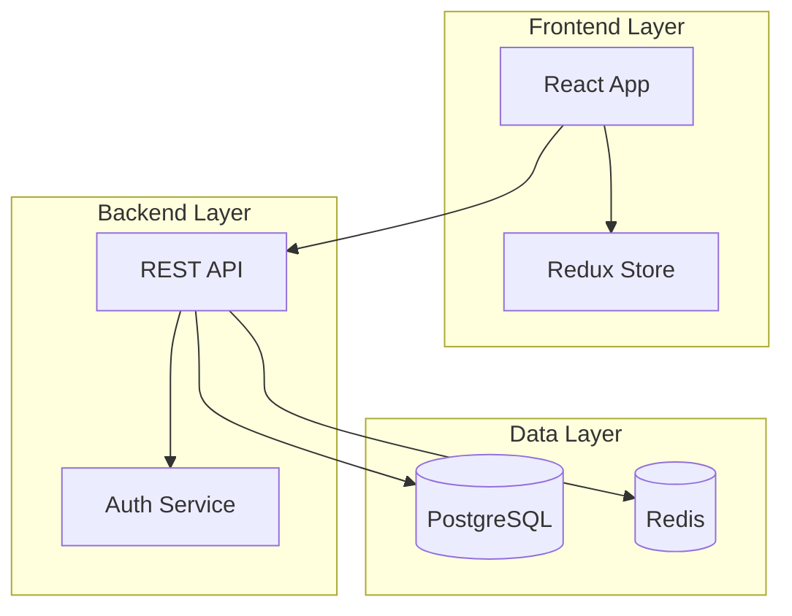

### Styling

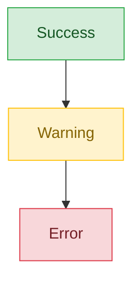

### Common Patterns

**API Flow:**
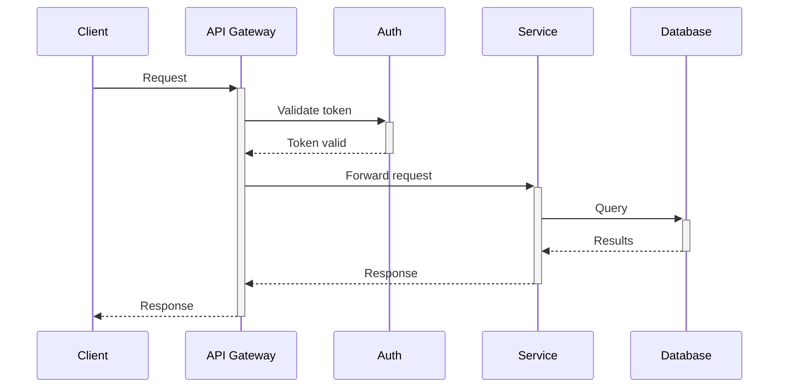

**Microservice Architecture:**
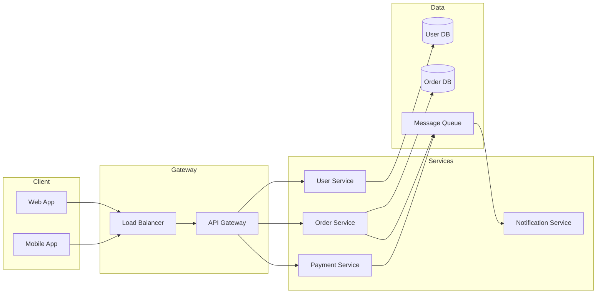

## Anti-Patterns to Avoid

| Anti-Pattern | Why It Is Bad | Fix |
|---|---|---|
| 50+ nodes in one diagram | Unreadable | Split into multiple diagrams |
| No edge labels | Relationships unclear | Add descriptive labels |
| Mixed abstraction levels | Confusing scope | One level per diagram |
| Using only rectangles | No visual distinction | Use appropriate shapes |
| No direction specified | Layout may surprise | Always specify `TD`, `LR`, etc. |
| Crossing lines everywhere | Hard to follow | Rearrange or split diagram |
