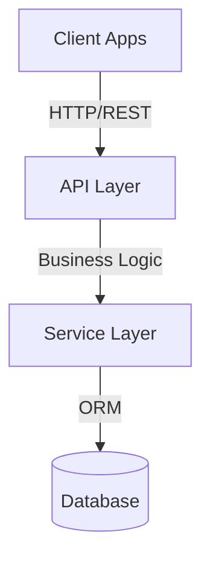
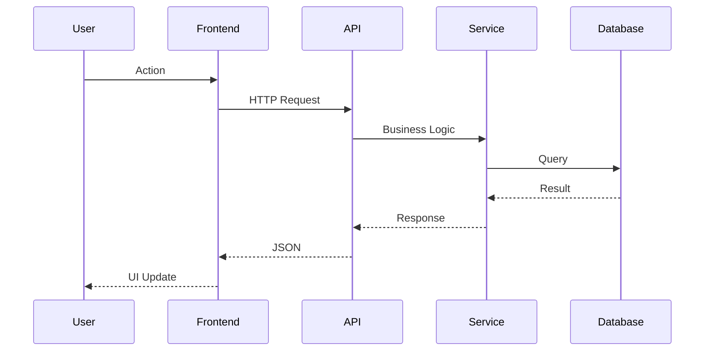

# Technical Analysis

## {{FEATURE_NAME}}

**Date**: {{DATE}}
**Related PDR**: [PDR.md](./PDR.md)
**Status**: Draft | In Review | Approved | Implemented
**Tech Lead**: {{TECH_LEAD}}

---

## 1. Executive Summary

**Feature Overview:** {{FEATURE_SUMMARY}}

**Technical Approach:** {{TECHNICAL_APPROACH}}

**Key Decisions:**

1. {{DECISION_1}}
2. {{DECISION_2}}
3. {{DECISION_3}}

**Estimated Complexity**: Low | Medium | High | Very High

**Estimated Timeline**: {{TIMELINE}}

---

## 2. Architecture Overview

### 2.1 System Architecture



**Description:** {{ARCHITECTURE_DESCRIPTION}}

### 2.2 Data Flow



---

## 3. Database Design

### 3.1 Schema Changes

#### New Tables

```sql
CREATE TABLE {{TABLE_NAME}} (
    id UUID PRIMARY KEY DEFAULT gen_random_uuid(),
    {{COLUMN_1}} VARCHAR(255) NOT NULL,
    {{COLUMN_2}} INTEGER NOT NULL,
    {{COLUMN_3}} TEXT,
    {{FOREIGN_KEY}} UUID REFERENCES {{OTHER_TABLE}}(id),
    created_at TIMESTAMP DEFAULT NOW() NOT NULL,
    updated_at TIMESTAMP DEFAULT NOW() NOT NULL,
    deleted_at TIMESTAMP
);
```

#### Modified Tables

- **Table**: {{TABLE_NAME}}
  - Add columns: {{COLUMNS_TO_ADD}}
  - Modify columns: {{COLUMNS_TO_MODIFY}}

### 3.2 Relationships

```mermaid
erDiagram
    {{ENTITY_A}} ||--o{ {{ENTITY_B}} : has
    {{ENTITY_B}} }o--|| {{ENTITY_C}} : belongs_to
```

### 3.3 Indexes

```sql
CREATE INDEX idx_{{table}}_{{column}} ON {{table}}({{column}});
```

**Justification:** {{INDEX_JUSTIFICATION}}

### 3.4 Migration Strategy

1. {{MIGRATION_STEP_1}}
2. {{MIGRATION_STEP_2}}
3. {{MIGRATION_STEP_3}}

**Rollback Plan:** {{ROLLBACK_PLAN}}

---

## 4. API Design

### 4.1 Endpoints

#### Create {{Entity}}

```
POST /api/{{resource}}
```

**Request:**

```json
{
  "{{field1}}": "{{type}}",
  "{{field2}}": "{{type}}"
}
```

**Response:** `201 Created`

```json
{
  "success": true,
  "data": {
    "id": "uuid",
    "{{field1}}": "value",
    "createdAt": "ISO-8601"
  }
}
```

#### List {{Entities}}

```
GET /api/{{resource}}?page=1&pageSize=20
```

#### Get {{Entity}}

```
GET /api/{{resource}}/:id
```

#### Update {{Entity}}

```
PUT /api/{{resource}}/:id
```

#### Delete {{Entity}}

```
DELETE /api/{{resource}}/:id
```

### 4.2 Error Handling

| Code | HTTP Status | Description |
|------|-------------|-------------|
| `VALIDATION_ERROR` | 400 | Input validation failed |
| `UNAUTHORIZED` | 401 | Not authenticated |
| `FORBIDDEN` | 403 | Not authorized |
| `NOT_FOUND` | 404 | Resource not found |
| `CONFLICT` | 409 | Resource already exists |

---

## 5. Service Layer

### 5.1 Service Structure

```typescript
class {{Entity}}Service {
  constructor(private repository: {{Entity}}Repository) {}

  async create({ input }: CreateInput): Promise<CreateOutput> {
    // Validate business rules
    // Create entity
    // Return result
  }

  async findById({ id }: FindByIdInput): Promise<FindByIdOutput> {
    // Fetch entity
    // Throw if not found
    // Return result
  }
}
```

### 5.2 Business Rules

1. {{BUSINESS_RULE_1}}
2. {{BUSINESS_RULE_2}}
3. {{BUSINESS_RULE_3}}

---

## 6. Testing Strategy

### 6.1 Test Coverage

**Unit Tests (90%+ coverage):**

- {{UNIT_TEST_SCENARIO_1}}
- {{UNIT_TEST_SCENARIO_2}}
- {{UNIT_TEST_SCENARIO_3}}

**Integration Tests:**

- {{INTEGRATION_TEST_SCENARIO_1}}
- {{INTEGRATION_TEST_SCENARIO_2}}

**E2E Tests:**

- {{E2E_TEST_SCENARIO_1}}

### 6.2 Test Data

**Fixtures:**

- {{FIXTURE_1}}: {{PURPOSE}}
- {{FIXTURE_2}}: {{PURPOSE}}

---

## 7. Security Considerations

- **Authentication**: {{AUTH_APPROACH}}
- **Authorization**: {{AUTHZ_APPROACH}}
- **Input Validation**: Zod schemas at API boundary
- **Data Protection**: {{DATA_PROTECTION_APPROACH}}

---

## 8. Performance Considerations

- **Database Optimization**: {{DB_OPTIMIZATION}}
- **Caching Strategy**: {{CACHING_STRATEGY}}
- **Expected Load**: {{EXPECTED_LOAD}}
- **Bundle Impact**: {{BUNDLE_IMPACT}}

---

## 9. Technical Risks

| Risk | Probability | Impact | Mitigation | Contingency |
|------|-------------|--------|-----------|-------------|
| {{RISK_1}} | High/Med/Low | High/Med/Low | {{MITIGATION_1}} | {{CONTINGENCY_1}} |
| {{RISK_2}} | High/Med/Low | High/Med/Low | {{MITIGATION_2}} | {{CONTINGENCY_2}} |

---

## 10. Implementation Checklist

- [ ] Database schema designed
- [ ] Validation schemas created
- [ ] Models/repositories implemented
- [ ] Services implemented
- [ ] API routes created
- [ ] Tests written (90%+ coverage)
- [ ] Documentation updated
- [ ] Security review passed
- [ ] Performance review passed

---

## 11. Related Documents

- [PDR (Product Design Requirements)](./PDR.md)
- [TODOs and Task Breakdown](./TODOs.md)

---

## Changelog

| Date | Author | Changes | Version |
|------|--------|---------|---------|
| {{DATE}} | {{AUTHOR}} | Initial draft | 0.1 |
